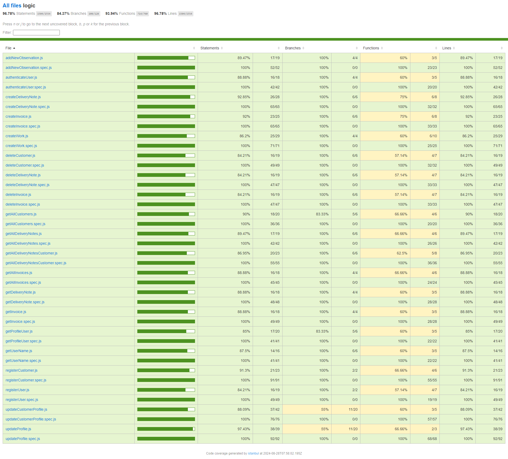

# API Documentation

## Endpoints

### Users

- **POST /users**
  - **Description:** Registers a new user.
  - **Request Body:** JSON object containing user details.
  - **Handler:** `registerUserHandler`

- **POST /users/auth**
  - **Description:** Authenticates a user.
  - **Request Body:** JSON object with authentication credentials.
  - **Handler:** `authenticateUserHandler`

- **GET /users/:targetUserId**
  - **Description:** Retrieves the username of the specified user.
  - **Parameters:**
    - `targetUserId` (string) - ID of the user.
  - **Handler:** `getUserNameHandler`

- **PATCH /users/:userId/update**
  - **Description:** Updates the profile of the specified user.
  - **Parameters:**
    - `userId` (string) - ID of the user.
  - **Request Body:** JSON object with updated profile details.
  - **Handler:** `updateProfileHandler`

- **GET /users/:targetUserId/profile**
  - **Description:** Retrieves the profile of the specified user.
  - **Parameters:**
    - `targetUserId` (string) - ID of the user.
  - **Handler:** `getProfileUserHandler`

### Customers

- **POST /customers**
  - **Description:** Registers a new customer.
  - **Request Body:** JSON object containing customer details.
  - **Handler:** `registerCustomHandler`

- **GET /customers**
  - **Description:** Retrieves a list of all customers.
  - **Handler:** `getAllCustomersHandler`

- **DELETE /customers/:customerId**
  - **Description:** Deletes the specified customer.
  - **Parameters:**
    - `customerId` (string) - ID of the customer.
  - **Handler:** `deleteCustomerHandler`

- **GET /customers/:customerId/delivery-notes**
  - **Description:** Retrieves all delivery notes for the specified customer.
  - **Parameters:**
    - `customerId` (string) - ID of the customer.
  - **Handler:** `getAllDeliveryNotesCustomerHandler`

- **PATCH /customers/:customerId/update**
  - **Description:** Updates the profile of the specified customer.
  - **Parameters:**
    - `customerId` (string) - ID of the customer.
  - **Request Body:** JSON object with updated profile details.
  - **Handler:** `updateCustomerProfileHandler`

### Delivery Notes

- **GET /delivery-notes**
  - **Description:** Retrieves all delivery notes.
  - **Handler:** `getAllDeliveryNotesHandler`

- **GET /delivery-notes/:deliveryNoteId**
  - **Description:** Retrieves details of the specified delivery note.
  - **Parameters:**
    - `deliveryNoteId` (string) - ID of the delivery note.
  - **Handler:** `getDeliveryNoteHandler`

- **DELETE /delivery-notes/:deliveryNoteId**
  - **Description:** Deletes the specified delivery note.
  - **Parameters:**
    - `deliveryNoteId` (string) - ID of the delivery note.
  - **Handler:** `deleteDeliveryNoteHandler`

- **POST /create/delivery-notes/:customerId**
  - **Description:** Creates a new delivery note for the specified customer.
  - **Parameters:**
    - `customerId` (string) - ID of the customer.
  - **Request Body:** JSON object with delivery note details.
  - **Handler:** `createDeliveryNoteHandler`

- **PATCH /create/work/delivery-notes/:deliveryNoteId**
  - **Description:** Updates work details for the specified delivery note.
  - **Parameters:**
    - `deliveryNoteId` (string) - ID of the delivery note.
  - **Request Body:** JSON object with work details.
  - **Handler:** `createWorkHandler`

- **PATCH /observation/delivery-note/:deliveryNoteId**
  - **Description:** Adds a new observation to the specified delivery note.
  - **Parameters:**
    - `deliveryNoteId` (string) - ID of the delivery note.
  - **Request Body:** JSON object with observation details.
  - **Handler:** `addNewObservation`

### Invoices

- **POST /create/invoices/:customerId**
  - **Description:** Creates a new invoice for the specified customer.
  - **Parameters:**
    - `customerId` (string) - ID of the customer.
  - **Request Body:** JSON object with invoice details.
  - **Handler:** `createInvoiceHandler`

- **GET /invoices**
  - **Description:** Retrieves all invoices.
  - **Handler:** `getAllInvoicesHandler`

- **GET /invoices/:invoiceId**
  - **Description:** Retrieves details of the specified invoice.
  - **Parameters:**
    - `invoiceId` (string) - ID of the invoice.
  - **Handler:** `getInvoiceHandler`

- **DELETE /invoices/:invoiceId**
  - **Description:** Deletes the specified invoice.
  - **Parameters:**
    - `invoiceId` (string) - ID of the invoice.
  - **Handler:** `deleteInvoiceHandler`

- **GET /:customerId/invoices**
  - **Description:** Retrieves all invoices for the specified customer.
  - **Parameters:**
    - `customerId` (string) - ID of the customer.
  - **Handler:** `getAllInvoicesCustomerHandler`

## Test Coverage

The project has a test coverage of more than 96%. This ensures that most features have been rigorously tested, minimizing the possibility of errors in production and guaranteeing a high level of code quality.

