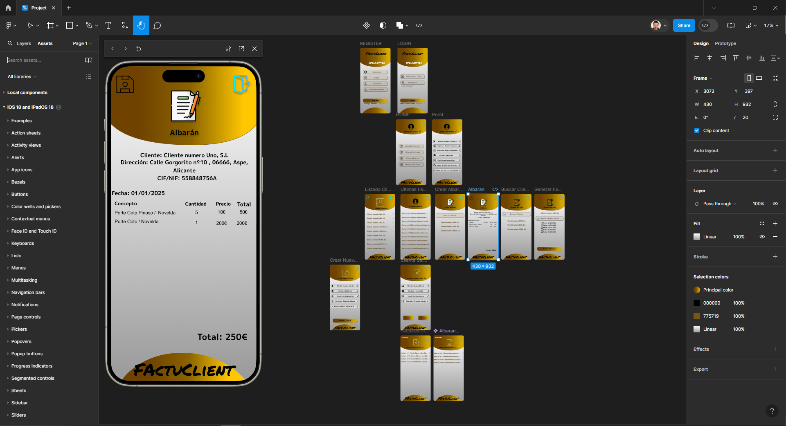
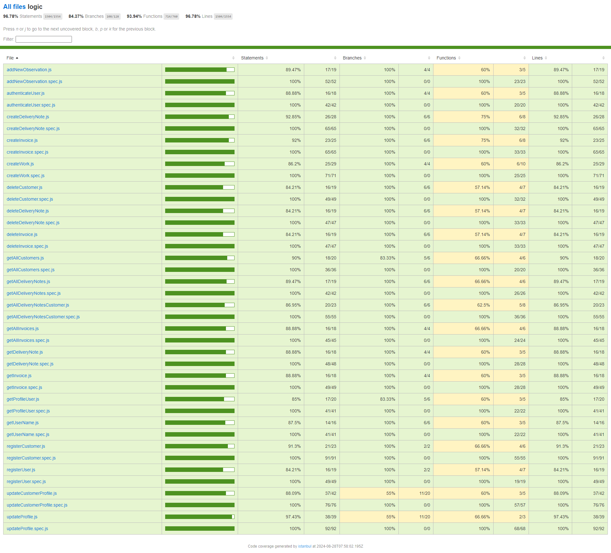

# FactuClient APP

## Application to store completed work and generate client invoices

## Functional

### ***Use Cases***

### User

- Create user
  - Edit user profile
    - User logo.
    - Full name.
    - Company name.
    - Company address.
    - Tax identification number.
    - Email.
    - Phone number.
    - Bank account number.

### Client

- Add Clients / Delete Clients
  - Edit client profile.
    - Client logo.
    - Full name or company name.
    - Company address.
    - Tax identification number.
    - Email.
    - Phone number.

- List Clients
  - Access each client.
    - See all invoices
      - Share invoices.
    - See all delivery notes
      - Share delivery notes.

### Delivery note work

- Add work done for each client
  - Client data
    - Delivery note number.
    - Delivery note date.
    - Concept.
    - Quantity of work done.
    - Date of work performed.
    - Unit price.
    - Total price.
    - Customer signature.
  
### Invoice Client

- Generate invoice from work performed.
  - Select client to invoice.
  - Invoice date.
  - Invoice number.
  - Select billing period.
  - Generate invoice button
  - Share via email/Whatsapp PDF

### UX/UI Design

[Figma Design prototype](https://www.figma.com/proto/fxphzzY7aubtHDbX4zHKbf/Project?node-id=4-28&t=qBCsgBBywESmmTzI-1&starting-point-node-id=4%3A28)

## Technical

### ***Data Model***

### User

- id (auto)
- fullName (string, required)
- username (string, required)
- companyName (string, required if company)
- address (string, required)
- taxId (string, required)
- email (string, required)
- phone (string, required)
- bankAccount(string, required if company)
- companyLogo (optional)
- role (string, customer / company)
- password (string, required)
- manager (User.id)
- active (boolean)

### DeliveryNote

- id (auto)
- date (string)
- number (string)
- company (User.id)
- customer (User.id)
- works ([Work.id])
- observations (string, input, optional)

### Work

- id(auto)
- concept(string)
- price(number)
- quantity(number)

#### Invoice

- id (auto)
- date (string)
- number (string)
- customer(User.id)
- company(User.id)
- deliveryNotes([DeliveryNote.id])
- observations (string, input, optional)
- paymentType (string, bank transfer, credit, cash)

### Blocks

- API
- APP
- DB

### Modules

- api
- app
- db
- doc

## Test Coverage

The project has a test coverage of more than 96%. This ensures that most features have been rigorously tested, minimizing the possibility of errors in production and guaranteeing a high level of code quality.

